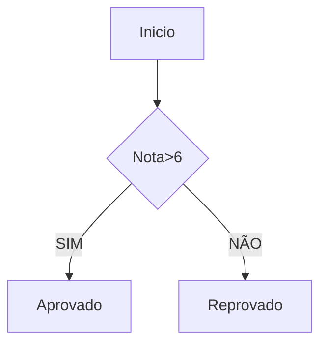
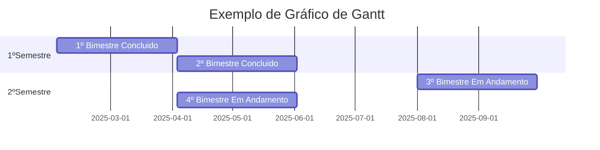

```mermaid
flowchart TD
  A(["Inicio"])
  A --> B{"Faça uma escolha"}
  B --> C{"OP1"}
  B--> E{"OP2"}
  B --> D{"OP3"}
  
```

```mermaid
graph TD;
  A[Inicio] --> B{Nota>6};
  B --> |SIM| C[Aprovado];
  B --> |NÃO| D[Reprovado];
```

```mermaid
gantt
  title Exemplo de Gráfico de Gantt
  dateFormat YYYY-MM-DD
section 1ºSemestre
1º Bimestre Concluido :a1, 2025-02-02, 60d
2º Bimestre Concluido:a2, after a1, 60d
section 2ºSemestre
3º Bimestre Em Andamento:a3, 2025-08-01, 60d
4º Bimestre Em Andamento:a4, after a1, 60d
```
