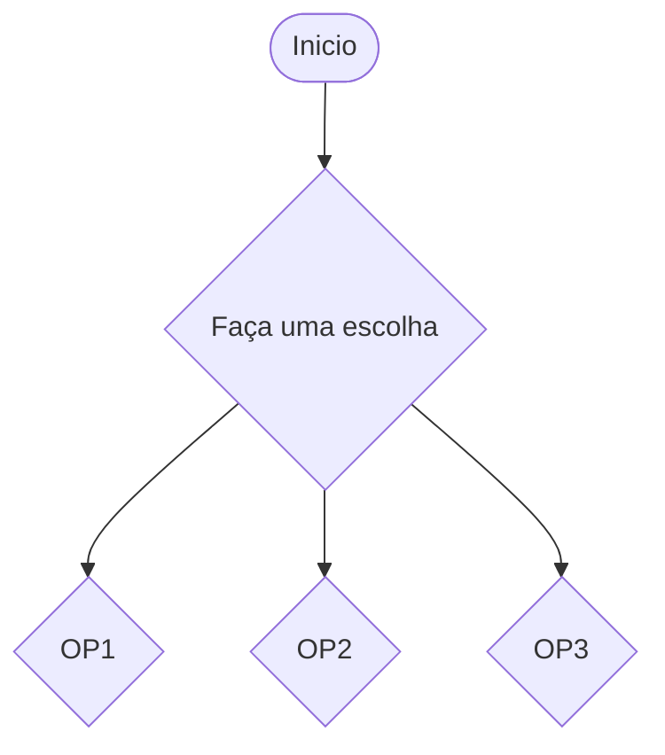
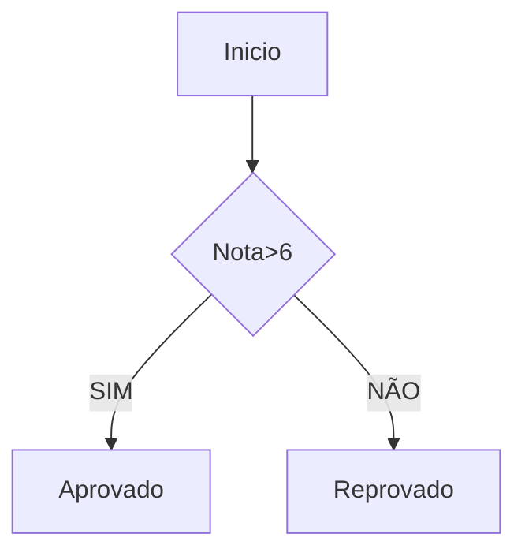
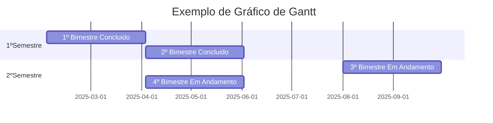

```mermaid
gantt
    title Cronograma do Projeto – Construção de uma Casa
    dateFormat  YYYY-MM-DD
    excludes    weekends

    section Planejamento
    Planejamento e Aprovações     :a1, 2025-10-01, 20d

    section Preparação
    Preparação do Terreno         :a2, after a1, 10d

    section Fundação
    Fundação                      :a3, after a2, 15d

    section Estrutura
    Estrutura da Casa             :a4, after a3, 30d

    section Instalações
    Instalações Elétricas e Hidráulicas :a5, after a4, 20d

    section Acabamentos
    Acabamento Interno            :a6, after a5, 25d
    Acabamento Externo           :a7, after a6, 15d

    section Finalização
    Inspeção Final e Entrega      :a8, after a7, 5d
