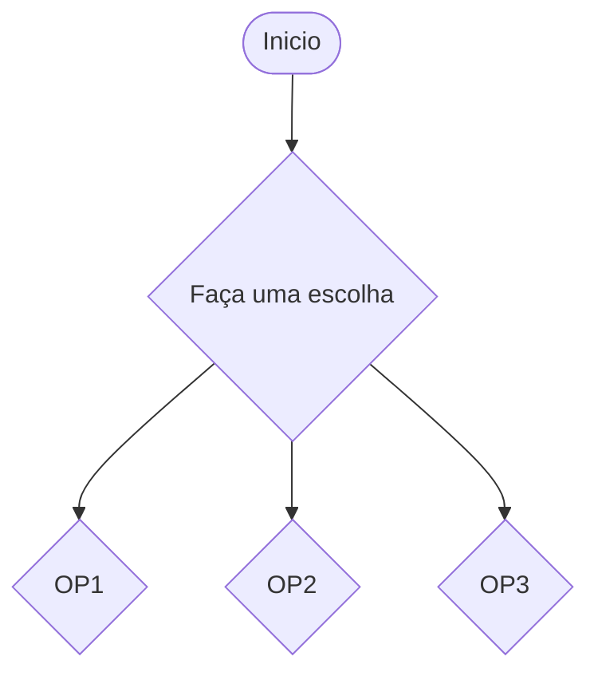
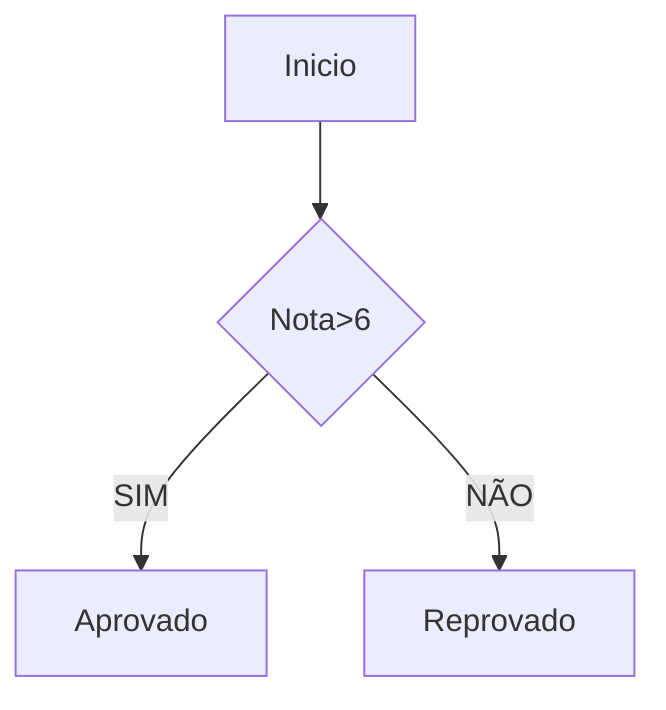
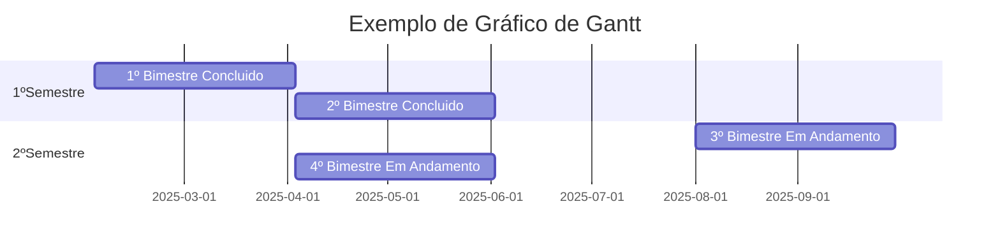
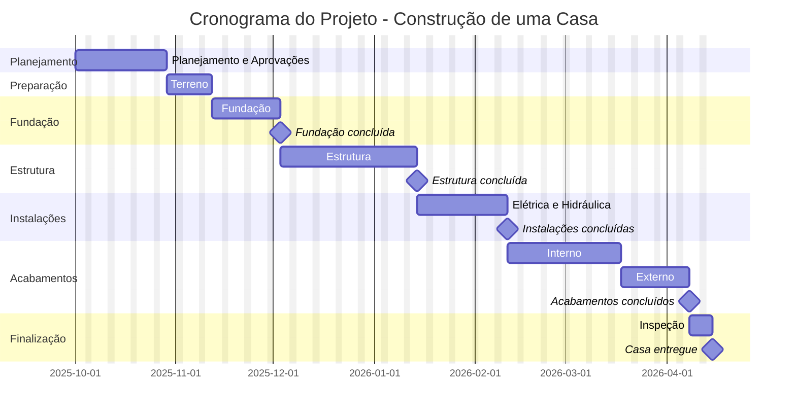

```mermaid
flowchart TD
  A(["Inicio"])
  A --> B{"Faça uma escolha"}
  B --> C{"OP1"}
  B--> E{"OP2"}
  B --> D{"OP3"}
  
```

```mermaid
graph TD;
  A[Inicio] --> B{Nota>6};
  B --> |SIM| C[Aprovado];
  B --> |NÃO| D[Reprovado];
```

```mermaid
gantt
  title Exemplo de Gráfico de Gantt
  dateFormat YYYY-MM-DD
section 1ºSemestre
1º Bimestre Concluido :a1, 2025-02-02, 60d
2º Bimestre Concluido:a2, after a1, 60d
section 2ºSemestre
3º Bimestre Em Andamento:a3, 2025-08-01, 60d
4º Bimestre Em Andamento:a4, after a1, 60d
```

```mermaid
gantt
    title Cronograma do Projeto - Construção de uma Casa
    dateFormat  YYYY-MM-DD
    excludes    weekends

    section Planejamento
    Planejamento e Aprovações :a1, 2025-10-01, 20d

    section Preparação
    Terreno :a2, after a1, 10d

    section Fundação
    Fundação :a3, after a2, 15d
    Fundação concluída :milestone, after a3, 0d

    section Estrutura
    Estrutura :a4, after a3, 30d
    Estrutura concluída :milestone, after a4, 0d

    section Instalações
    Elétrica e Hidráulica :a5, after a4, 20d
    Instalações concluídas :milestone, after a5, 0d

    section Acabamentos
    Interno :a6, after a5, 25d
    Externo :a7, after a6, 15d
    Acabamentos concluídos :milestone, after a7, 0d

    section Finalização
    Inspeção :a8, after a7, 5d
    Casa entregue :milestone, after a8, 0d
```
